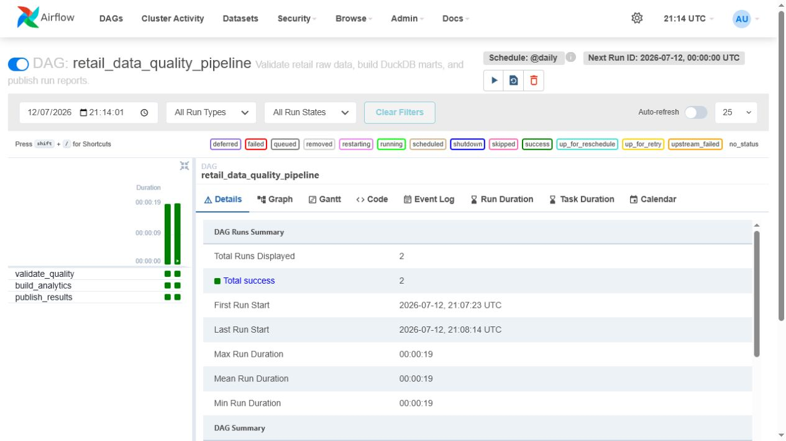
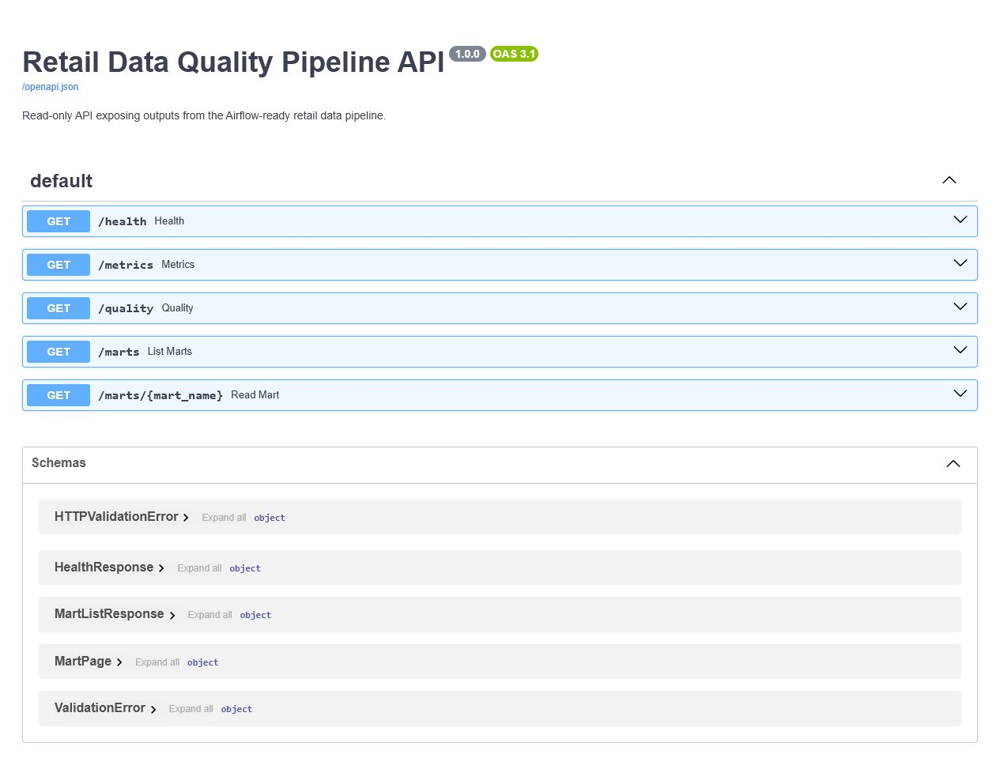
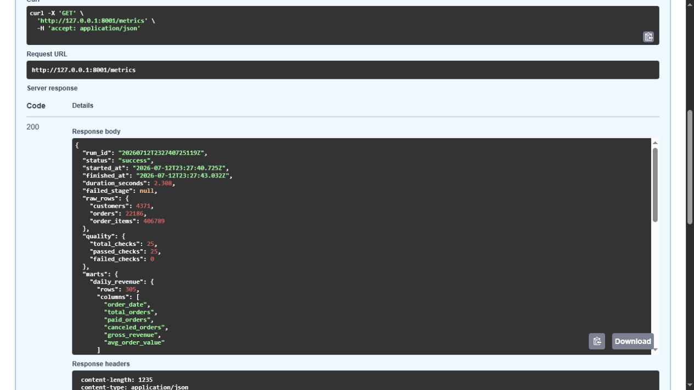

# Airflow Data Quality Pipeline

[](https://github.com/Umbura/airflow-data-quality-pipeline/actions/workflows/ci.yml)

Backend data pipeline for retail transaction ingestion, quality validation, analytical mart generation, orchestration, and read-only result serving.

Version 1.0.0 provides an end-to-end local backend path. It prepares a real public dataset, blocks invalid inputs, builds a DuckDB warehouse, publishes portable artifacts, exposes results through FastAPI, and orchestrates the stages with Airflow.

## Overview

The implementation separates source preparation, raw loading, quality validation, warehouse transformation, result publication, and API access. Local execution and Airflow use the same Python stage functions, which keeps orchestration independent from business logic.

The default path uses local files and requires no paid services, cloud account, or external database.

## Implemented Scope

- Reproducible preparation of the complete UCI Online Retail dataset.
- Normalized customer, order, and order-item raw tables.
- Twenty-five critical schema and data quality checks.
- Failure reports written before transformation is blocked.
- Atomic DuckDB and CSV artifact publication.
- Revenue marts with paid and canceled orders separated.
- Three-task Airflow DAG with retry and concurrency controls.
- FastAPI service with readiness status and paginated marts.
- Docker services for pipeline, API, and optional Airflow runtime.
- Stage-level logs with configurable severity.
- GitHub Actions validation for formatting, lint, coverage, compilation, Compose, and a pipeline smoke run.
- Thirty-five automated tests with 94% statement and branch coverage.

## Execution Flow

```text
UCI Online Retail CSV
  -> retail-prepare-uci
      -> customers.csv
      -> orders.csv
      -> order_items.csv
  -> validate_quality
      -> quality_report.json
      -> stop on critical failure
  -> build_analytics
      -> warehouse.duckdb
      -> daily_revenue.csv
      -> customer_revenue.csv
      -> product_revenue.csv
      -> country_revenue.csv
  -> publish_results
      -> run_summary.json
  -> retail-api
      -> health, metrics, quality, and mart endpoints
```

The component model and failure semantics are documented in [docs/architecture.md](docs/architecture.md).

## Runtime Evidence

The following screenshots were captured from the local Docker runtime after successful pipeline execution.

### Airflow Orchestration



The Airflow grid records successful execution of `validate_quality`, `build_analytics`, and `publish_results`.

### API Contract



The generated OpenAPI interface documents health, metrics, quality, mart discovery, and paginated mart endpoints.

### Full Dataset Run



The metrics endpoint records 4,371 customers, 22,186 orders, 406,789 order items, 25 passed quality checks, and no failed stage.

## Dataset

The committed normalized tables are derived from the complete UCI Machine Learning Repository Online Retail dataset.

- Source: https://archive.ics.uci.edu/dataset/352/online%2Bretail
- Citation: `Chen, D. (2015). Online Retail [Dataset]. UCI Machine Learning Repository. https://doi.org/10.24432/C5BW33`
- License: Creative Commons Attribution 4.0 International
- Reproducible CSV mirror: https://raw.githubusercontent.com/databricks/Spark-The-Definitive-Guide/master/data/retail-data/all/online-retail-dataset.csv

Attribution and reuse terms are recorded in [DATA_LICENSE.md](DATA_LICENSE.md).

## Data Quality Gate

Validation covers:

- required tables and columns;
- non-empty tables and non-null fields;
- non-blank identifiers and descriptive fields;
- unique customer and order keys;
- accepted status and segment domains;
- positive and finite numeric values;
- parseable invoice and order dates;
- order-to-customer referential integrity;
- order-item-to-order referential integrity.

A critical failure writes `quality_report.json` and a failed `run_summary.json`, then prevents warehouse replacement. Successful output writes use temporary files followed by atomic replacement.

## Local Execution

Create the local configuration and install dependencies:

```bash
cp .env.example .env
uv sync --frozen --extra dev
```

Only variables prefixed with `RETAIL_` are loaded from `.env`. Already exported environment variables take precedence. `RETAIL_DATASET_MAX_ROWS=0` configures complete source ingestion.

Run validation and the pipeline:

```bash
uv run ruff format --check .
uv run ruff check .
uv run pytest -q --cov --cov-report=term-missing
uv run retail-pipeline
```

Prepare the dataset again when required:

```bash
uv run retail-prepare-uci
```

The source URL and row limit come from `RETAIL_DATASET_CSV_URL` and `RETAIL_DATASET_MAX_ROWS`. The `--max-rows` option can override the configured limit for an individual execution.

Set `RETAIL_LOG_LEVEL` to `DEBUG`, `INFO`, `WARNING`, `ERROR`, or `CRITICAL` to control command-line pipeline logs.

## Docker

Execute the pipeline and start the API:

```bash
docker compose up --build api
```

The host port can be changed with `RETAIL_API_HOST_PORT`, for example `RETAIL_API_HOST_PORT=8001`.

Start the Airflow profile:

```bash
docker compose --profile airflow up --build airflow
```

Detailed runtime and recovery commands are available in [docs/operations.md](docs/operations.md).

## API

Start locally:

```bash
uv run retail-api
```

OpenAPI documentation is available at `http://127.0.0.1:8000/docs`.

| Endpoint | Purpose |
| --- | --- |
| `GET /health` | Artifact readiness and latest pipeline status. |
| `GET /metrics` | Latest run summary. |
| `GET /quality` | Latest quality report. |
| `GET /marts` | Available analytical marts. |
| `GET /marts/daily-revenue` | Paginated daily metrics. |
| `GET /marts/customer-revenue` | Paginated customer metrics. |
| `GET /marts/product-revenue` | Paginated product metrics. |
| `GET /marts/country-revenue` | Paginated country metrics. |

Mart endpoints accept `limit` from 1 to 1,000 and a non-negative `offset`.

## Airflow

The DAG in `dags/retail_data_quality_pipeline.py` contains three observable tasks:

1. `validate_quality`
2. `build_analytics`
3. `publish_results`

The DAG runs daily, retries a failed task once, disables catchup, and allows one active run because the local artifact paths are shared.

## Current Results

The committed artifacts were generated from all 541,909 source rows available in the documented CSV mirror.

| Metric | Result |
| --- | ---: |
| Source rows read | 541,909 |
| Normalized transaction rows | 406,789 |
| Customers | 4,371 |
| Orders | 22,186 |
| Paid orders | 18,532 |
| Canceled orders | 3,654 |
| Data quality checks | 25 |
| Failed quality checks | 0 |
| Analytical marts | 4 |
| Automated tests | 35 passed |
| Test coverage | 94% |

The generated ranking tables are summarized in [docs/results_snapshot.md](docs/results_snapshot.md).

## Validation

| Validation | Result |
| --- | --- |
| Local pipeline | passed |
| Quality gate | 25 of 25 checks passed |
| Automated tests | 35 passed |
| Test coverage | 94% |
| Ruff format | passed |
| Ruff lint | passed |
| Python compilation | passed |
| Docker runtime build | passed |
| Containerized API smoke test | passed |
| Airflow 2.11.2 DAG import | passed |
| Airflow DAG test | 3 of 3 tasks succeeded |

The Airflow execution evidence is recorded in [docs/airflow_validation.md](docs/airflow_validation.md) and `reports/airflow_validation.json`.

## Repository Layout

```text
.github/workflows/       continuous integration
dags/                    Airflow DAG definition
data/raw/                normalized source tables
data/processed/marts/    generated analytical marts
docs/                    architecture, operations, and result notes
reports/                 generated JSON reports
src/retail_pipeline/     dataset, quality, warehouse, pipeline, and API code
tests/                   automated test suite
compose.yaml             local pipeline, API, and Airflow services
Dockerfile               runtime and Airflow image targets
```

## Deployment Extensions

The local backend is complete for portfolio use. Production-specific extensions include incremental ingestion, a managed warehouse, centralized observability, API authentication, and deployment-specific secret management.

## References

- UCI Online Retail: https://archive.ics.uci.edu/dataset/352/online%2Bretail
- Dataset DOI: https://doi.org/10.24432/C5BW33
- Apache Airflow: https://airflow.apache.org/
- DuckDB: https://duckdb.org/
- FastAPI: https://fastapi.tiangolo.com/

Project and dataset terms are documented in [LICENSE](LICENSE) and [DATA_LICENSE.md](DATA_LICENSE.md).
