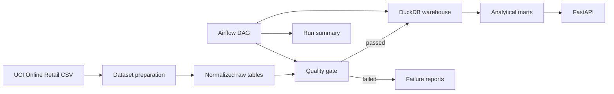

# Architecture

## System Boundary

The project implements a local analytical data platform for a normalized sample of the UCI Online Retail dataset. The boundary includes source preparation, raw data validation, warehouse transformation, analytical marts, orchestration, and read-only result access.

## Components

| Component | Responsibility |
| --- | --- |
| Dataset preparation | Downloads the source sample and normalizes customers, orders, and order items. |
| Quality stage | Evaluates schema, completeness, uniqueness, domain, numeric, date, and referential constraints. |
| Warehouse stage | Builds the DuckDB fact table and four analytical marts. |
| Publication stage | Writes a portable run summary with timing, outputs, and failure context. |
| Airflow DAG | Orchestrates quality, warehouse, and publication as separate tasks. |
| FastAPI | Exposes pipeline status, quality results, and paginated mart records. |

## Failure Semantics

Critical quality failures stop transformation before the warehouse is modified. Quality and run reports are still written so the failure can be diagnosed outside the process.

Warehouse and CSV outputs use temporary files followed by atomic replacement. A failed write does not intentionally expose a partially generated artifact. Airflow limits the DAG to one active run because the local storage target is shared.

## Storage Model

The raw layer contains normalized CSV files. DuckDB stores the joined fact table and raw table copies. CSV marts provide portable outputs for review and API serving.

The generated marts are:

- daily revenue;
- customer revenue;
- product revenue;
- country revenue.

Paid and canceled orders are counted separately. Revenue and units sold include paid orders only.

## Design Constraints

The implementation uses local storage to remain reproducible without cloud accounts or paid services. It is suitable for portfolio evaluation and local execution. Incremental ingestion, distributed execution, and a managed warehouse remain deployment-specific extensions.
